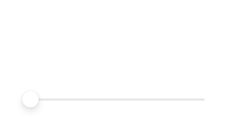
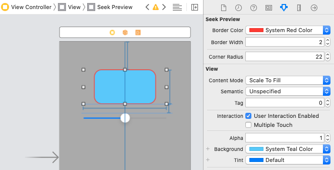
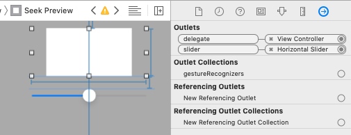

# SeekPreview

[](https://cocoapods.org/pods/SeekPreview)
[](https://cocoapods.org/pods/SeekPreview)
[](https://cocoapods.org/pods/SeekPreview)

Attach a SeekPreview to a seekBar to show small preview images of the seek action.



## Usage
You just need to create a `SeekPreview` object, pass it a `SeekPreviewDelegate` to provide preloaded preview images, and attach the preview to a `UISlider` that belongs to the same view hierarchy as the preview.

### Programmatically

```swift
let slider = UISlider()
view.addSubview(slider)
// then add constraints to position the slider on the screen

let preview = SeekPreview()
preview.delegate = self
view.addSubview(preview)
// then add constraints to position the preview on the screen
// (put the preview on top of the slider with some vertical spacing)

preview.attachToSlider(slider: slider) // This needs to be called after views are added in the same view hierarchy
```

### Delegate
You need to set the preview delegate to provide the preview images when requested.

Images will be requested synchronously on the main thread as soon as the value changes from the slider. Therefore we suggest to prefetch those images in advance.

Since you probably don't have a preview for each specific value that the slider can have, you are expected to always return the closest preview that you have for that value.

N.B. We don't provide a way to prefetch those images. This is NOT in the scope of this library.

### Customize Animations
You can create a SeekPreview with a custom animator. You just need to create a class that conforms to the `SeekPreviewAnimator` protocol and pass it in the init.

### Customize Appearence
You can just change the SeekPreview properties: `borderColor`, `borderWidth` and `cornerRadius` to change the UI of the inner preview holding the images.

### Storyboard
You can also create a view directly from the storyboard. 

You can customize the Appearence with the attribute inspector.



You can also attach Slider and Delegate via the outlets (much like you would do with a TableView delegate and dataSource).



In case you should use the storyboard you'll have the default animator, but you can later change it programmatically.

## Example

To run the example project, clone the repo, and run `pod install` from the Example directory first.

## Installation

SeekPreview is available through [CocoaPods](https://cocoapods.org). To install
it, simply add the following line to your Podfile:

```ruby
pod 'SeekPreview'
```

## Author

Enricoza, enricozannini93@gmail.com

## License

SeekPreview is available under the MIT license. See the [LICENSE](LICENSE) file for more info.
